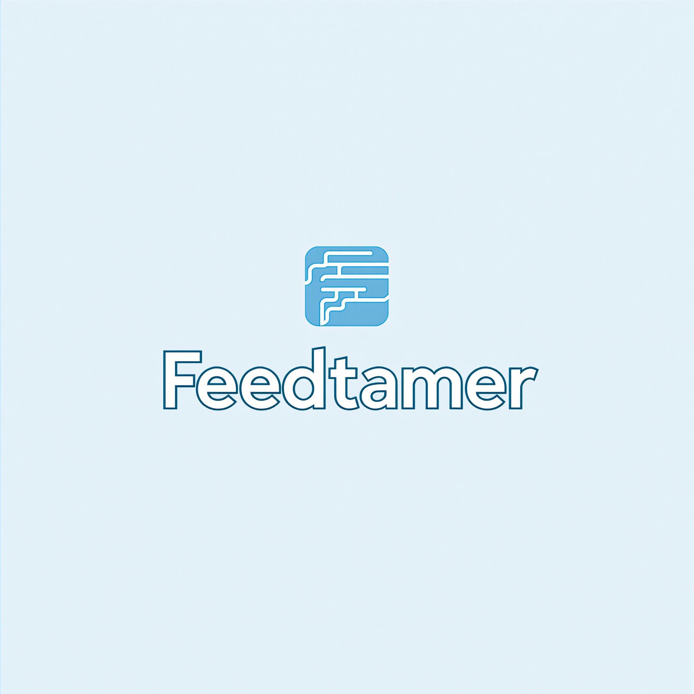

# Feedstamer - Reclaim Your Attention

Feedstamer is a cross-platform application designed to help users reclaim their attention by providing a curated content experience from selected authoritative accounts across multiple platforms.



## Features

- **Curated Content Feeds**: Select specific accounts from various platforms and view their content in a clean, distraction-free interface
- **Cross-Platform Support**: iOS, Android, and Web applications
- **Feeds Management**: Organize accounts by platform or custom categories
- **Attention Analytics**: Track usage statistics and time saved
- **Distraction Elimination**: No algorithmic recommendations, endless scrolling, or attention-hijacking features

## Project Structure

- `/mobile`: React Native (Expo) application for iOS and Android
- `/backend`: Node.js/Express backend API
- `/web`: (Coming soon) React.js web application
- `/docs`: Documentation, requirements, and design specifications

## Getting Started

### Mobile App (iOS/Android)

```bash
# Navigate to the mobile directory
cd mobile

# Install dependencies
npm install

# Start the development server
npm start

# For iOS
npm run ios

# For Android
npm run android
```

### Backend API

```bash
# Navigate to the backend directory
cd backend

# Install dependencies
npm install

# Set up environment variables
cp .env.example .env
# Edit .env with your configuration

# Start the development server
npm run dev
```

## Architecture

### Mobile App

The mobile application is built with React Native using Expo, providing a cross-platform solution for both iOS and Android. Key architectural components include:

- **Expo Router**: For navigation
- **Context API**: For global state management
- **Async Storage**: For local data persistence
- **Native modules**: For platform-specific functionality

### Backend API

The backend is a Node.js application with Express, providing RESTful APIs for:

- User authentication and management
- Platform integration (Twitter, Instagram, YouTube, etc.)
- Content retrieval and caching
- Analytics tracking

Data is stored in MongoDB with Mongoose for data modeling.

## Monetization Strategy

Feedstamer follows a freemium model:

- **Free Tier**: 
  - Up to 10 accounts across platforms
  - Basic analytics
  - Standard interface
  
- **Premium Tier** ($5.99/month or $49.99/year):
  - Unlimited accounts
  - Advanced analytics and insights
  - Custom categories and organization
  - Content filtering options
  - No advertisements
  
- **Family Plan** ($9.99/month):
  - Premium features for up to 5 family members
  
- **Enterprise** (custom pricing):
  - Team management
  - Advanced analytics
  - Custom integrations

## Design Philosophy

Feedstamer's design follows these core principles:

1. **Minimalism**: Remove unnecessary elements and distractions
2. **Intentional Consumption**: Enable conscious choices about content
3. **Time Respect**: Features designed to save time, not consume it
4. **User Control**: Users in charge of their attention, not algorithms

## Revenue Path to $20,000/month

- 4,000 premium subscribers @ $5/month = $20,000/month
- Alternative mix:
  - 2,500 individual subscribers @ $5/month = $12,500
  - 500 annual subscribers @ $50/year = $2,083/month
  - 200 family plans @ $10/month = $2,000/month
  - 50 small business accounts @ $100/month = $5,000/month

## Screenshots


## License

Copyright © 2023-2025 Feedstamer. All rights reserved.